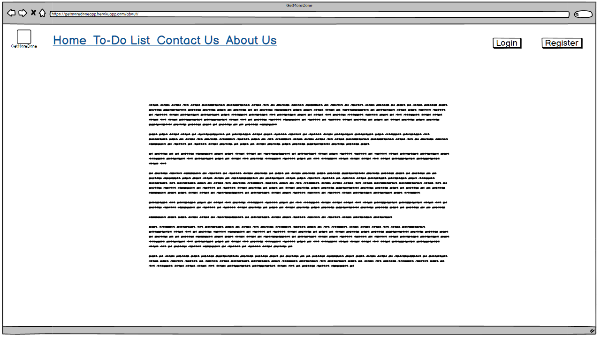

# GetMoreDone

## Introduction
Ever wondered how to organize your tasks but never quite got a solution? Well your search ends here, GetMoreDone - Task Manager App meets all your requirements of managing tasks.
GetMoreDone is an Irish Task Manager App which encourages users to Create, Edit/Update and Delete day-to-day tasks in a very organized and relaxed fasion.
The website is aimed at users who want to keep their tasks organized and easily accesible, achieve more every day and reach that mental clarity they've been longing for.
Users have the ability to register, log in and log out of their account, create, edit and delete tasks.

## Showcase

### Live Website
A deployed link to the website can be found [here](https://getmoredoneapp.herokuapp.com/)

# Table of Contents
- [Table of Contents](#table-of-contents)
- [Introduction](#introduction)
- [UX](#ux-user-experience)
- [Agile Development Process](#agile-development-process)
- [Design](#design)
- [Features](#features)
- [Technologies Used](#technologies-used)
- [Testing](#testing)
- [Deployment](#deployment)
- [Credits](#credits)
- [Acknowledgements](#acknowledgements)

## UX User Experience
### User Stories

### As the site creator/admin:
* I want to have full access and functionality as a superuser
* I want to be able to create, read, edit and delete all tasks
* I want to be able to assign tasks to different users so that tasks are well organized.

### As the site user:
* I want to be able to register an account
* I want to be able to login/logout an account
* I want to be able create, view, edit and delete my tasks
* I want to be able to mark tasks as complete or pending so that my tasks list will be updated showing the relevant value.

## Agile Development Process
* The MoSCoW method was adopted to approach to prioritizing which project requirements for must have, should have, could have and will not have.
* I used GitHub for Automated Kanban Project Management. [Click Here](static/images/gmd-stories.png)
* I used GitHub project board to generate user story templates.
* I used project templates to speed up the process. 

## Design
### Wireframes
 

  
Click here to view all wireframes:

  
  
  
  
  
  
  

  

### Navigation

I created a logic flowchart to help organise the site structure.
The ERD entity relationship diagram helped visually to confirm user roles and the permissions.

  
Click here to view website navigation:

  

  

### Database Schema

## Features
### Existing Features

### Home Page
Homepage displays the Logo, Navbar with following options: Home, To-Do List, Contact Us, About Us - on the left, and on the right side - Login and Register.
There is a H1 heading describing what the website is about so that users understand the websites function and target audience, followed by a H3 and a H5 descriptions about website's functions.
The main body of the homepage contains 3 images.
At the buttom of the page, we can find a "Let's Get Started button" which takes the user to the login page.

### Navigation Bar
When not logged in the Navbar displays links to Home, To-Do List,  Register & Login.
When a user hovers over navigation links, the buttons are highlighted to show responsiveness when the user interacts with the link element(s). When a user is logged in the Navbar displays links to Home, To-Do List, About Us, Contact Us to the left. On the right-hand side we have the logged in username and a Logout option.

### Register Page
When a user goes the Register page, they are shown a simple form with username and password to sign in.

### Log in
When a user goes to the Login page, they can enter account details as above.

### Log out
When a user logs out successfully a message is displayed to confirm.

### Admin - Superuser Access

### Add New Task

### Edit / Delete Task

## Future Features

* About Us Page - Add information that informs the user when the website was formed and what it aims to achieve.
* Contact Us Page - Add a simple form with name, email and body of message via which Users can contact the website.

## Bugs / Errors encountered during development
* Error related to Django 4, which has recently been fully released. Set variable CSRF_TRUSTED_ORIGINS in the settings.py, which holds a list of all the URLs of sites that are trusted.
* App wasn’t deploying to heroku. Created a runtime.txt file and updated python version to python-3.9.14.
* Heroku H10 error. Fixed by adding the correct keys to config vars.
* I was aware of various pylint and flak8 notifications however none of them are having any functionality implications and were as a result of the template followed from the code institute Django blog project Walkthrough.

### Unfixed Bugs
No known unfixed bugs present at the time of submission

## Technologies Used
### Languages Used
  * [HTML5](https://developer.mozilla.org/en-US/docs/Web/HTML)
  * [CSS3](https://developer.mozilla.org/en-US/docs/Web/CSS)
  * [JavaScript](https://www.javascript.com/)
  * [Python](https://www.python.org/)
  * [Django] (https://www.djangoproject.com/)
  * [SQL-Postgres] (https://www.postgresql.org/)

### Frameworks, Libraries & Programs Used
* [amiresponsive](http://ami.responsivedesign.is/) to see how responsive the site is on different devices.
* [Balsamiq](https://balsamiq.com/) was used to create the Wireframes.
* [Django](https://www.djangoproject.com/) is a free and open-source, Python-based web framework that follows the model–template–views architectural pattern.
* [Font Awesome](https://fontawesome.com/) was used for icons for aesthetic and UX purposes on the buttons.
* [Git](https://git-scm.com/) was used for version control by utilizing the Gitpod terminal to commit to Git and Push to GitHub.
* [GitHub](https://github.com/) GitHub is used to store the projects code after being pushed from Git.
* [Gitpod](https://www.gitpod.io/) An online IDE linked to the GitHub repository used to write my code.
* [Google Chrome Dev tools](https://developer.chrome.com/docs/devtools/) for debugging.
* [Google Lighthouse](https://developers.google.com/web/tools/lighthouse) used for audits to measure the quality of web pages.
* [Heroku](https://www.heroku.com/) used to deploy this app, a cloud platform as a service supporting several programming languages.
* [Pexels](https://www.pexels.com/) Images for this project were sourced from Pexels.

## Testing

### Lighthouse Report
 

  
Click here to see the Lighthouse Report

  

  

### The W3C Markup Validator
  

  
Click here to see the W3C Markup Validator result

  

  

### W3C CSS Validator
  

  
Click here to see the W3C CSS Validator result

  

  

  ### Python 
  

  
Checked Python code is formatted according to the PEP 8 standards

  

  

## Deployment
* This project was developed using a GitPod workspace. The code was committed to Git and pushed to GitHub using the terminal.

* Log in to [Heroku](https://id.heroku.com/login) or create an account
* On the main page click New and Create New App
* Note: new app name must be unique
* Next select your region
* Click Create App button
* Click in resources and select Heroku Postgres database
* Click Reveal Config Vars and add new config "SECRET_KEY"
* Click Reveal Config Vars and add new config "DISABLE_COLLECTSTATIC = 1"
* The next page is the project’s Deploy Tab. Click on the Settings Tab and scroll down to Config Vars
* Next, go to Buildpack section click Add Buildpack select python and Save Changes
* Scroll to the top of the page and choose the Deploy tab
* Select Github as the deployment method
* Confirm you want to connect to GitHub
* Search for the repository name and click the connect button
* Scroll to the bottom of the deploy page and select the preferred deployment type
* Click either Enable Automatic Deploys for automatic deployment when you push updates to Github

## Credits and Acknowledgements

* [Code Instite](https://learn.codeinstitute.net/dashboard)
* [Stack Overflow](https://stackoverflow.com)
* To create this website, I relied on material covered in the Full Stack Development course by Code Institute.
* Martina Terlevic for advise and feedback.
* Shubham Sarda - [Udemy](https://www.udemy.com/)

